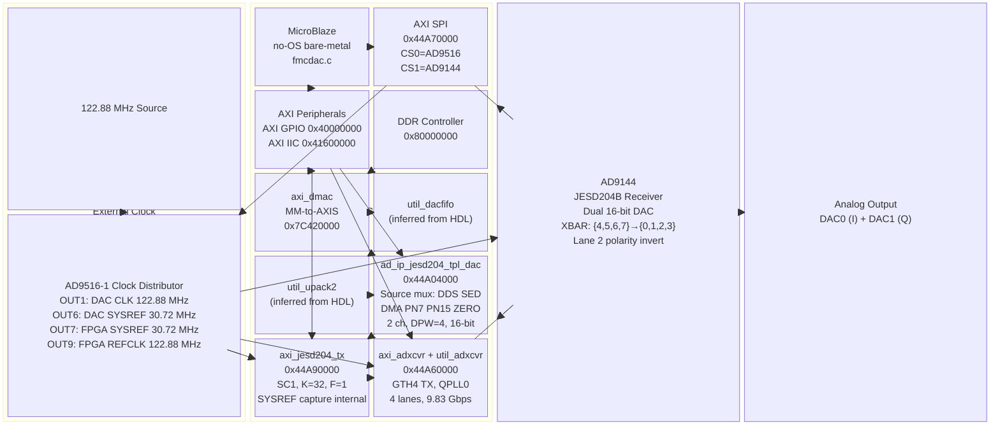
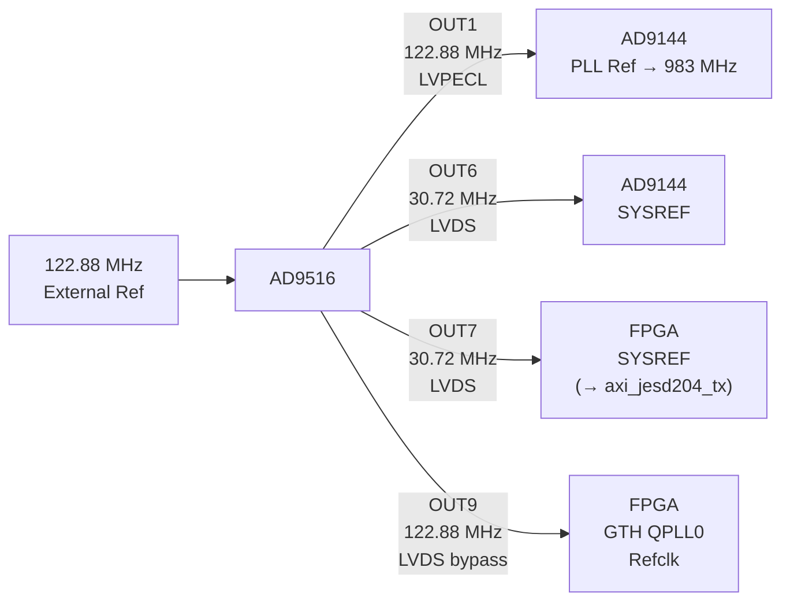
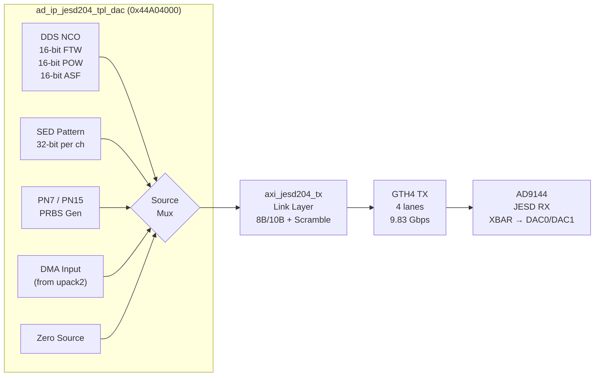

# FMCDAC System Block Diagram



## GPIO Pin Mapping

```
AXI GPIO (0x40000000) bit assignments:
  Bit 40  — DAC_RESET      (active-low reset to AD9144)
  Bit 41  — DAC_TXEN        (DAC transmit enable)
  Bit 38  — CLKD_SYNC       (AD9516 SYNC pulse)
  Bit 22  — dac_ctrl[1]     (DAC analog output control)
  Bit 21  — dac_ctrl[0]     (DAC analog output control)
```

## Clock and SYSREF Routing



## Data Path Detail



## Notes

- **GTH4** (not GTY): XCKU5P on KCU116 has GTH transceivers
- **util_dacfifo** and **util_upack2** are standard ADI HDL IPs inferred from the reference design; firmware does not interact with them directly
- **SYSREF capture** is handled inside `axi_jesd204_tx` (registers `0x100`–`0x108`), not a separate IP
- **DMA playback** path (DDR → DMAC → FIFO → UPACK → TPL) exists in hardware but is **not currently exercised** by firmware — only DDS, SED, and PN paths are tested
- **Si5328** (via AXI IIC at `0x41600000`) is present in hardware but **bypassed** (`SKIP_SI5328`) — GTH REFCLK comes directly from AD9516 OUT9
